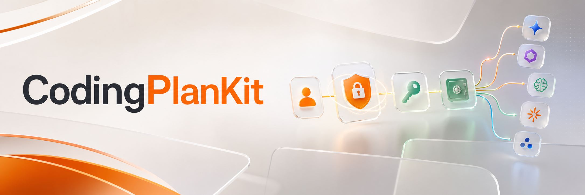

<p align="center">
  
</p>

<p align="center">
  <a href="https://github.com/atom2ueki/CodingPlanKit/actions/workflows/swift.yml"></a>
  <a href="https://swift.org"></a>
  
  <a href="./LICENSE"></a>
</p>

Sign users in to ChatGPT (OAuth 2.0 + PKCE, Keychain-backed) and call the
Codex backend on the user's plan instead of your API key — no per-token
billing. Two SwiftPM products — pick `CodingPlanAuth` alone for OAuth, add
`CodingPlanCodex` when you want plan-bound chat / streaming / image
generation / usage.

## Install

```swift
.package(url: "https://github.com/atom2ueki/CodingPlanKit.git", from: "0.1.0"),
```

```swift
.target(
    name: "MyApp",
    dependencies: [
        .product(name: "CodingPlanAuth", package: "CodingPlanKit"),
        .product(name: "CodingPlanCodex", package: "CodingPlanKit"),
    ]
)
```

For iOS, register a custom URL scheme in `Info.plist` (e.g. `myapp`) so
`ASWebAuthenticationSession` can return cleanly from the OAuth redirect.

## Install the skill (let your code agent integrate it for you)

CodingPlanKit ships a [Claude Code](https://docs.claude.com/en/docs/claude-code/overview)
skill so an AI agent in your editor can integrate the SDK without you having
to read the source. Inside Claude Code:

```
/plugin marketplace add atom2ueki/CodingPlanKit
/plugin install coding-plan-kit@coding-plan-kit
```

After that, prompts like *"add CodingPlanKit auth to this iOS app"* or
*"stream a Codex response with image generation"* trigger the skill
automatically. The skill reads from [`llms.txt`](./llms.txt) for the full
public surface, so it stays in sync with the source.

## Quick start

```swift
import SwiftUI
import CodingPlanAuth

@MainActor
@Observable
final class SignIn {
    private let service: AuthService
    private let provider = OpenAIAuthProvider(callbackScheme: "myapp")
    private let browser = BrowserAuthSession()
    var credentials: Credentials?

    init() throws {
        // KeychainTokenStorage() throws when there's no servicePrefix and
        // no Bundle.main.bundleIdentifier (CLI/test contexts). In a normal
        // iOS/macOS app target the bundle id is always present and this
        // never throws — propagating rather than crashing keeps misconfigured
        // hosts (e.g. CLI tools without an explicit servicePrefix) loud.
        service = AuthService(storage: try KeychainTokenStorage())
    }

    func signIn() async throws {
        await service.register(provider)
        let session = try await service.beginLogin(providerId: "openai")
        let callbackURL = try await browser.authenticate(
            url: session.authURL,
            callbackScheme: "myapp"
        )
        credentials = try await service.completeLogin(
            session: session,
            with: callbackURL
        )
    }
}
```

Then call plan-bound APIs with `CodingPlanCodex`:

```swift
import CodingPlanCodex

let codex = OpenAICodexClient()

// One-shot:
let response = try await codex.createTextResponse(
    prompt: "Refactor this Swift function...",
    credentials: credentials
)

// Stream deltas:
for try await delta in codex.streamTextResponse(prompt: "...", credentials: credentials) {
    print(delta, terminator: "")
}
```

## Documentation

- [`llms.txt`](./llms.txt) — file-by-file index for AI agents and humans.
- DocC catalogs:
  [`CodingPlanAuth`](./Sources/CodingPlanAuth/Documentation.docc/CodingPlanAuth.md),
  [`CodingPlanCodex`](./Sources/CodingPlanCodex/Documentation.docc/CodingPlanCodex.md).

## Acknowledgements

### Built on

- [SwiftWebServer](https://github.com/atom2ueki/SwiftWebServer) — local loopback HTTP listener used for the OAuth callback during sign-in.

### Inspired by

- [openai/codex](https://github.com/openai/codex)
- [sugarforever/rn-ai-kit](https://github.com/sugarforever/rn-ai-kit)
- [Vercel AI SDK](https://github.com/vercel/ai)
- [badlogic/pi-mono](https://github.com/badlogic/pi-mono)

## License

[MIT](./LICENSE) © 2026 Tony Li
